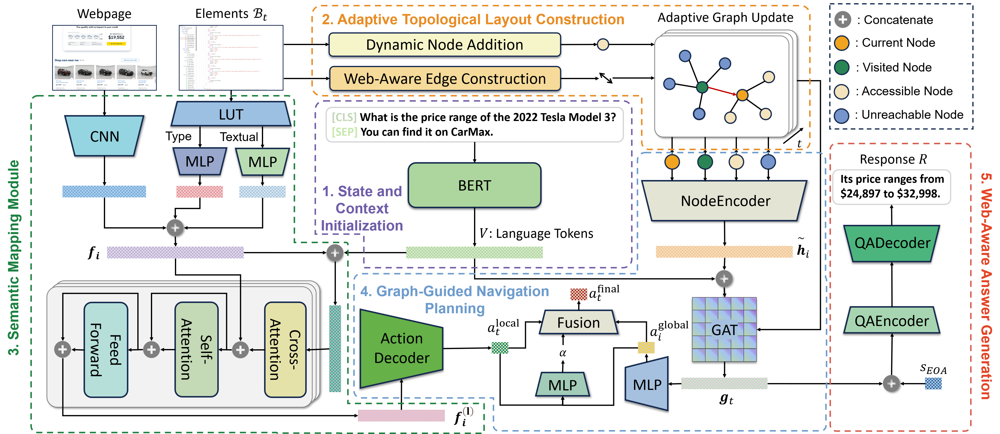
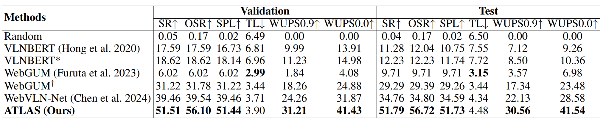
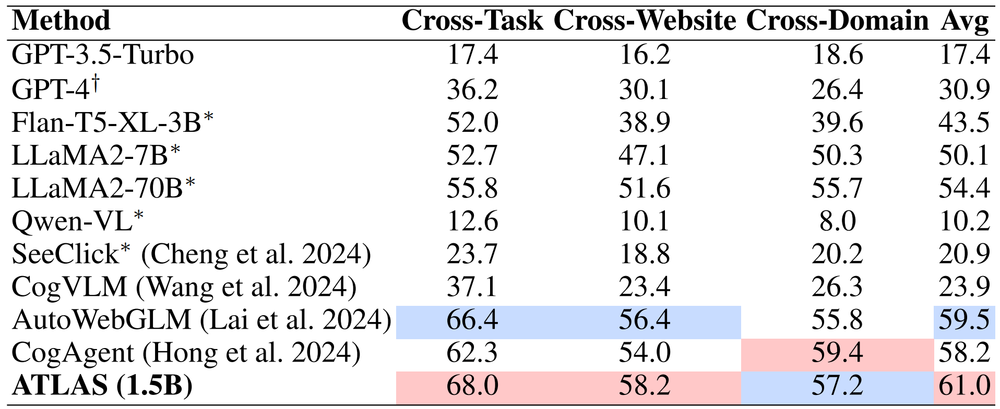
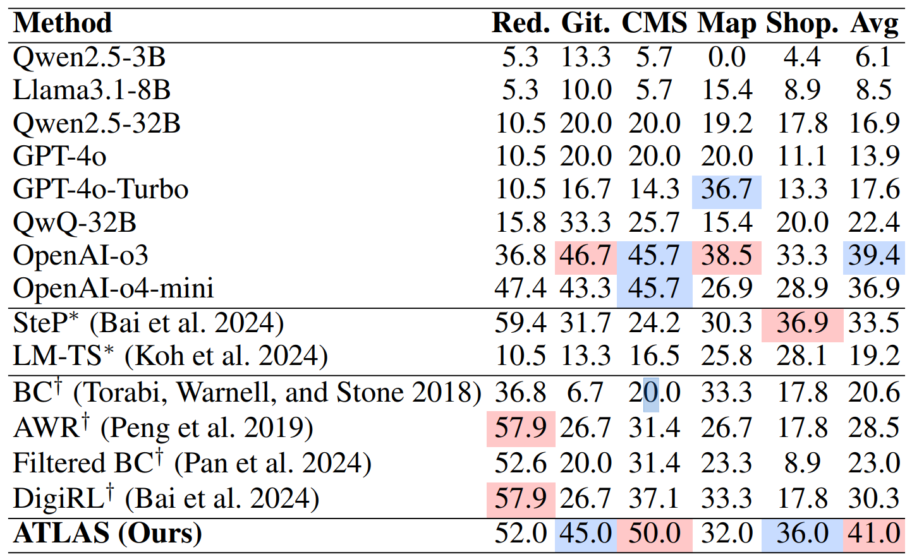

# ATLAS: Lightweight Adaptive Topological Layout And Semantic Mapping in Vision-and-Language Navigation on Websites


## Abstract 📝
Vision-and-Language navigation on websites requires agents to navigate target webpages and answer questions based on human instructions. Current web agents primarily leverage Large Language Models (LLMs) for semantic understanding and reasoning, but still suffer from limited navigation performance and slow inference speed. Constructing a global map across webpages can effectively enhance both navigation accuracy and efficiency, however, this is challenged by the open structure of web navigation graphs and the dynamic nature of web layouts. In this paper, we propose **ATLAS**: Adaptive Topological Layout And Semantic mapping, a framework that adaptively constructs a time-varying, unbounded topological map across webpages and unifies heterogeneous elements through semantic representation.
This enables both global path planning and local element selection for web-based navigation and question answering. As a lightweight approach, ATLAS significantly outperforms existing state-of-the-art methods on the WebVLN benchmark with a 10% improvement in success rate, and achieves the highest average task success rate on both the Mind2Web and WebArena benchmarks.

---

## To Do List ✅
- [ ] Release of training code upon paper acceptance. ⏳
- [ ] Release of model checkpoints upon paper acceptance (due to GitHub file size limitations and anonymity requirements). 📦🔒

---

## Method Overview 🗺️

<p align="center"><em>Overview of ATLAS. ATLAS consists of five main components: (1) State and Context Initialization, (2) Adaptive Topological Layout Construction, (3) Semantic Mapping Module, (4) Graph-Guided Navigation Planning, and (5) Web-Aware Answer Generation.</em></p>

---

## Download WebVLN Dataset 🚀
The WebVLN-v1 dataset and pre-trained models can be downloaded from [here](https://drive.google.com/drive/folders/1Gzm44P5QBxvBYUU4BiYW-WlxbiB5M19K?usp=sharing). Please organize the data as follows:

```
|- ATLAS
    |- Downloads
        |- ckpt
            |- best_val
        |- Data
            |- seen
                | ...
            |- zero_shot
                | ...
            |- img_feats.pkl
            | ...
        |- Oscar
            | ... 
        |- Prevalent
            | ...
```

## Download best_val Checkpoint 🏅
The `best_val` checkpoint can also be downloaded separately from [here](). After downloading, please place the file in the following directory:

```
ATLAS/Downloads/ckpt/best_val
```

---

## Installation and Usage ⚙️

### Installation 💻
```bash
cd ATLAS
conda create --name atlasenv python=3.9
conda activate atlasenv
pip install torch==1.11.0+cu113 torchvision==0.12.0+cu113 torchaudio==0.11.0 --extra-index-url https://download.pytorch.org/whl/cu113
pip install nltk putils pytorch_transformers transformers tensorboard tensorboardX networkx
pip install langchain==0.0.246 openai==0.28.1
```

### Training 🏋️
```bash
cd ATLAS
bash run/train.bash
```

### Inference 🔍
```bash
cd ATLAS
bash run/eval.bash
```

---

## Experimental Results 📊

### Key Performance 🌟
- **WebVLN Success Rate**: 51.79%
- **2–5× Faster** than Llama 3-8B
- **17.03% Improvement** over previous SOTA methods

### WebVLN Benchmark Results 🏆

<p align="center"><em>Comparison with navigation-based methods on the WebVLN dataset. ∗ indicates the model is initialized by LXMERT. WebGUM and WebGUM† denote models based on T5-small and T5-base, respectively.</em></p>

<p align="center">
  
</p>
<p align="center"><em>Comparison with LLM-based methods on the WebVLN dataset. ∗ denotes the use of GPT-4. [1]: (Liu et al. 2023b), [2]: (Zhou, Hong, and Wu 2024), [3]: (Wang, Zhuang, and Wu 2025).</em></p>

### Mind2Web Performance 🌐
<p align="center">
  
</p>
<p align="center"><em>Task success rate on Mind2Web. The best scores are highlighted in red and the secondary scores in blue. Avg: Average. ∗ indicates model finetuning on the training set; † denotes element selection from the top-10 element candidates, others from the top-50, following previous works (Lai et al. 2024).</em></p>

### WebArena Performance 🕹️
<p align="center">
  
</p>
<p align="center"><em>Task success rate on WebArena-Lite (Offline). The best scores are highlighted in red and the secondary scores in blue. Avg: Average. ∗: model based on GPT-4o. †: model based on Llama3.1-8B.</em></p>

---

